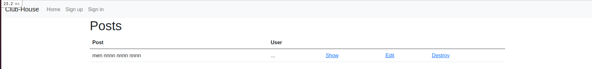

# ClubHouse
This project is a Clubhouse app. The idea is to create an app where the members of the Club can publish posts anonymously. Everyone outside the club should be able to see those posts but not the name of the author unless they are members of the Club.

## App Home Page

## Getting Started :
- Clone the repository: `git clone` https://github.com/NoTengoBattery/club-house.git
- Move inside the club-house folder: `cd club-house`
- Run: `rails db:create` and `rails db:migrate`.
- Run the server: `rails s` or `rails server`
- To see the app on your local machine open your browser and type: `localhost:3000`. Have fun !!!

## Live preview
Check this application deployed to Heroku using [this](https://fierce-ocean-40125.herokuapp.com/) link.

## BUILT WITH

    -HTML
    -CSS
    -bootstrap
    -Ruby
    -Ruby on Rails

##  AUTHORS

👤 **Widzmarc Jean Nesly Phelle**

- GitHub: [@widzthedvloper](https://github.com/widzthedvloper)
- Twitter: [@widzthedvloper](https://twitter.com/widzthedvloper)
- LinkedIn: [@widzthedvloper](https://www.linkedin.com/in/widzmarc-jean-nesly-phelle-252a26129/)

👤 **Oever González**

- GitHub: [@NoTengoBattery](https://github.com/NoTengoBattery)
- Twitter: [@NoTengoBattery](https://twitter.com/NoTengoBattery)
- LinkedIn: [@notengobattery](https://www.linkedin.com/in/notengobattery/)

## SHOW YOUR SUPPORT
Give a :star: if you like this project!

## 📝 LICENSE
This project is [MIT](/LICENSE) licensed.
